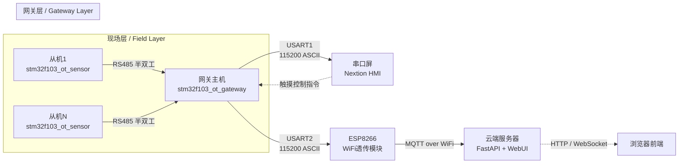
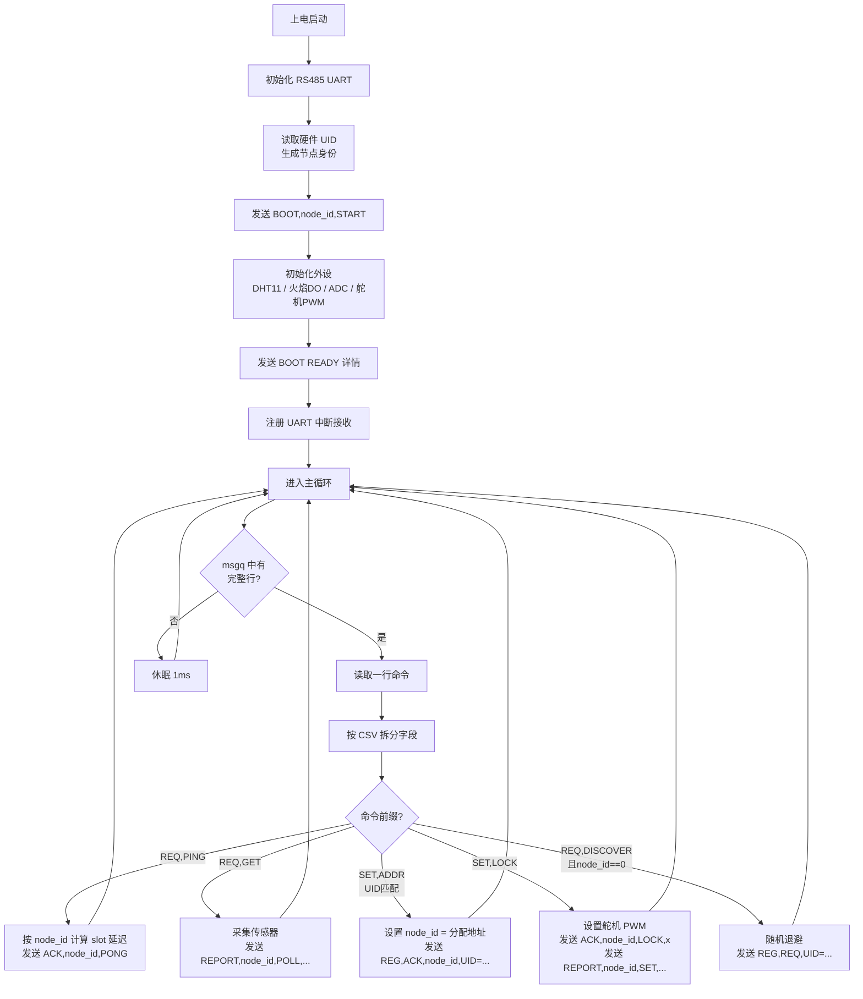
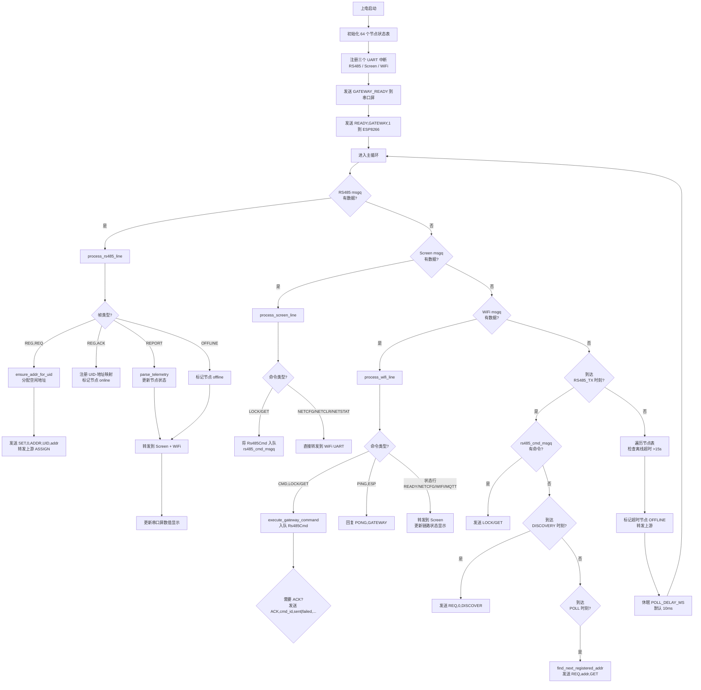
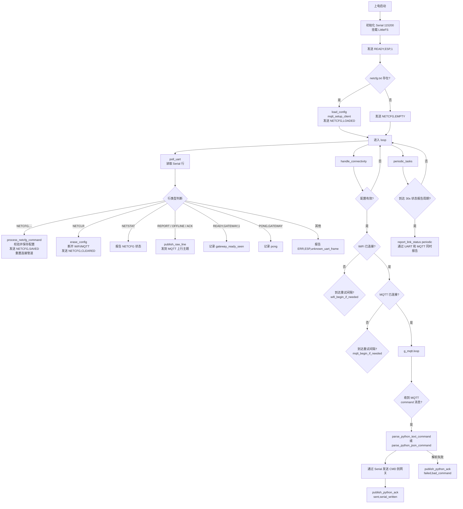
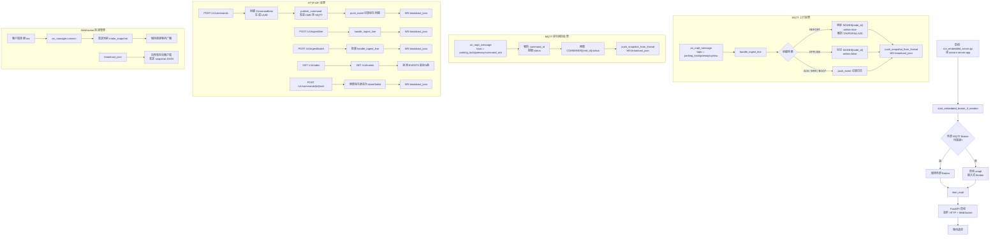
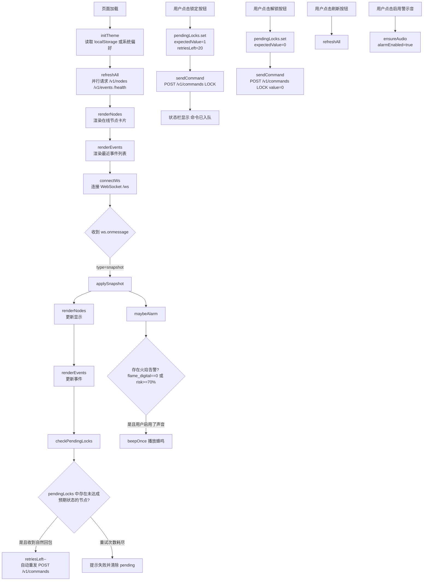
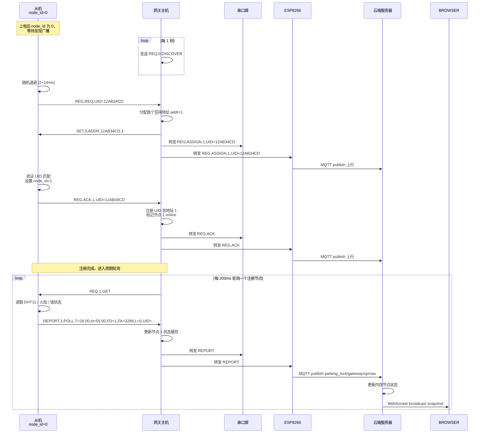
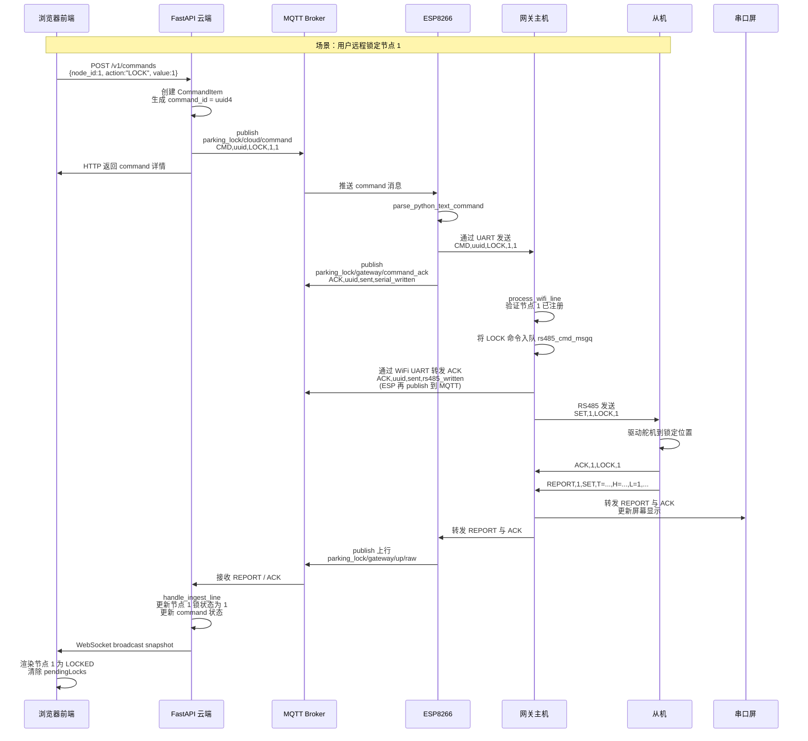
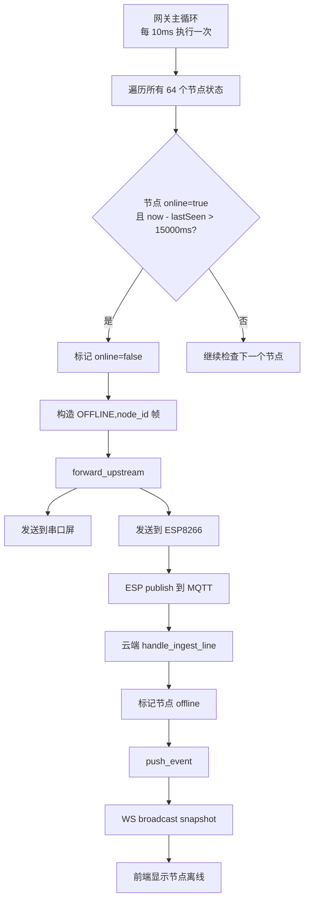

# 车位锁系统流程图文档

> 本文档使用 Mermaid 语法绘制，可在支持 Mermaid 的编辑器（VS Code、Typora、GitHub 等）中直接渲染为图形。

---

## 1. 总体系统架构图

### 说明
- **从机**：负责传感器采集（DHT11 温湿度、火焰数字/模拟量）与车位锁舵机控制。
- **网关主机**：RS485 总线调度中心，轮询从机、转发数据到串口屏与 ESP8266。
- **串口屏**：现场人机交互界面，显示状态并下发 `LOCK/GET` 指令。
- **ESP8266**：负责 WiFi 连接、MQTT 连接、网络配置持久化、云-端协议转换。
- **云端服务器**：FastAPI 后端，维护节点状态、事件日志、命令队列，提供 WebSocket 实时推送。
- **浏览器前端**：Vue/Quasar 风格的单页应用，通过 WebSocket 实时查看节点状态并远程控制。

---

## 2. 从机（Slave）主循环流程图

### 关键细节
- **总线冲突避免**：发送前检测 RS485 总线空闲时间（`RS485_IDLE_GUARD_MS=4ms`），若忙则随机退避后重试。
- **DHT 读取容错**：DHT11 在舵机动作时可能读取失败，使用上一次有效缓存值避免上报异常尖峰。
- **中断驱动接收**：UART ISR 将接收到的字符组装成行，通过 `k_msgq` 投递到主循环处理。

---

## 3. 网关主机（Gateway）主循环流程图

### 关键细节
- **三路 UART 并发**：RS485（总线）、Screen（串口屏）、WiFi（ESP8266）各自有独立的 ISR + msgq。
- **调度优先级**：RS485 发送槽的优先级为 `显式命令 > 发现探测 > 周期轮询`。
- **UID 自注册**：网关通过 `DISCOVER` 探测未注册从机，从机以 `REG,REQ` 响应，网关分配地址后下发 `SET,0,ADDR`。
- **离线判定**：节点超过 `NODE_OFFLINE_TIMEOUT_MS=15000ms` 未收到任何帧即判定为离线，向上游广播 `OFFLINE` 事件。

---

## 4. ESP8266 WiFi 模块主循环流程图

### 关键细节
- **配置持久化**：网络配置（SSID、密码、MQTT 地址等）保存在 LittleFS 的 `/netcfg.txt` 中，掉电不丢失。
- **双格式命令支持**：云端下发的命令可以是文本格式 `CMD,id,LOCK,1,1`，也可以是 JSON 格式 `{"command_id":"...","action":"LOCK","node_id":1,"value":1}`。
- **链路状态聚合**：`LINK` 帧将 WiFi 状态、IP 地址、断连原因、MQTT 状态聚合为一行，同时通过 UART 发给网关并通过 MQTT 发给云端。
- **状态透传**：ESP8266 不对 `REPORT/OFFLINE/ACK` 等内容做解析，直接透传到 MQTT 上行主题。

---

## 5. 云端服务器（Cloud Backend）处理流程图

### 关键细节
- **内存存储**：节点状态 `NODES`、事件队列 `EVENTS`、命令表 `COMMANDS` 均为内存结构，重启后清空。
- **实时广播**：任何导致状态变化的事件（REPORT、OFFLINE、命令创建、命令 ACK）都会触发 WebSocket 广播，前端无需轮询。
- **双通道接入**：网关数据既可以通过 `serial_mqtt_bridge.py` 经 MQTT 进入，也可以通过 `serial_http_bridge.py` 直接调用 HTTP `/v1/ingest/line` 进入。
- **命令生命周期**：`pending` -> `sent` (publish 成功) -> `done/failed` (收到网关 ACK)。

---

## 6. 前端 Web UI 交互流程图

### 关键细节
- **自动重试机制**：前端在点击锁定/解锁后，会进入 `pendingLocks` 状态。若 WebSocket 推送的节点快照中锁状态未变为预期值，且该节点的 `updated_at` 有变化（说明收到了新的自然回包），则自动重试，最多 20 次。
- **ACK 过滤**：网关的命令执行回执（ACK）不会更新节点的 `updated_at`，因此不会误触发自动重试。
- **主题切换**：支持亮/暗主题，优先使用用户手动选择，否则跟随系统偏好。
- **30 秒兜底轮询**：即使 WebSocket 断开，每 30 秒也会通过 HTTP 刷新一次，保证数据不会长期停滞。

---

## 7. 设备注册与轮询时序图

---

## 8. 云到端控制命令完整时序图

---

## 9. 离线检测与上报流程图

---

## 附录：协议速查表

### RS485 从机-网关协议（ASCII, \r\n 结尾）
| 方向 | 帧格式 | 说明 |
|------|--------|------|
| 网关->从机 | `REQ,<node_id>,PING` | 心跳探测 |
| 网关->从机 | `REQ,<node_id>,GET` | 请求上报传感器数据 |
| 网关->从机 | `SET,<node_id>,LOCK,<0\|1>` | 控制车位锁 |
| 网关->从机 | `REQ,0,DISCOVER` | 广播发现未注册从机 |
| 网关->从机 | `SET,0,ADDR,<UID>,<addr>` | 给指定 UID 分配地址 |
| 从机->网关 | `ACK,<node_id>,PONG` | PING 响应 |
| 从机->网关 | `REPORT,<node_id>,<reason>,T=..,H=..,FD=..,FA=..,L=..` | 状态上报 |
| 从机->网关 | `REG,REQ,UID=...` | 请求注册 |
| 从机->网关 | `REG,ACK,<addr>,UID=...` | 注册确认 |

### 网关-ESP8266 UART 协议
| 方向 | 帧格式 | 说明 |
|------|--------|------|
| 网关->ESP | `READY,GATEWAY,1` | 网关启动就绪 |
| 网关->ESP | `REPORT,... / OFFLINE,... / REG,...` | 透传上行数据 |
| 网关->ESP | `NETCFG,<ssid>,...,<mqtt_pass>` | 网络配置 |
| 网关->ESP | `NETCLR` | 清除配置 |
| 网关->ESP | `ACK,<cmd_id>,<status>,<code>` | 命令执行回执 |
| ESP->网关 | `READY,ESP,1` | ESP 启动就绪 |
| ESP->网关 | `CMD,<cmd_id>,LOCK,<node_id>,<0\|1>` | 云端下发命令 |
| ESP->网关 | `CMD,<cmd_id>,GET,<node_id>` | 云端请求轮询 |
| ESP->网关 | `LINK,... / WIFI,... / MQTT,...` | 链路状态报告 |

### MQTT 主题
| 主题 | 方向 | 说明 |
|------|------|------|
| `parking_lock/gateway/up/raw` | 网关 -> 云端 | 原始上行数据 |
| `parking_lock/cloud/command` | 云端 -> 网关 | 下行控制命令 |
| `parking_lock/gateway/command_ack` | 网关 -> 云端 | 命令执行回执 |
